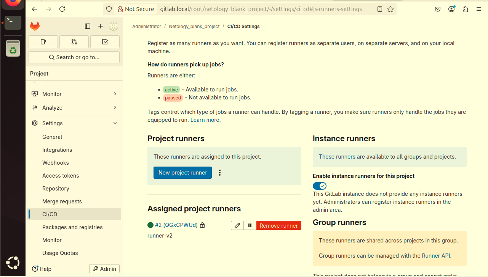
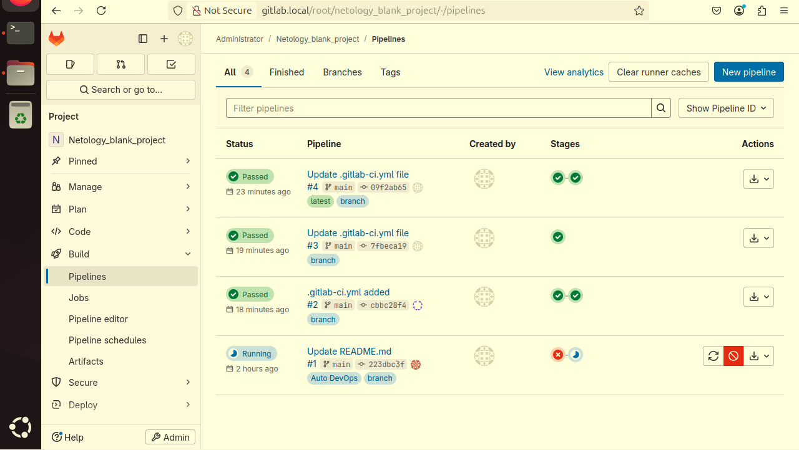

# Домашнее задание к занятию "`Работа с GitLab и CI/CD`" - `Хомяков Антон`

---

# Домашнее задание

## Задание 1

Что нужно сделать:
1. Разверните GitLab локально, используя Vagrantfile и инструкцию, описанные в этом репозитории.
2. Создайте новый проект и пустой репозиторий в нём.
3. Зарегистрируйте gitlab-runner для этого проекта и запустите его в режиме Docker. Раннер можно регистрировать и запускать на той же виртуальной машине, на которой запущен GitLab.
В качестве ответа в репозиторий шаблона с решением добавьте скриншоты с настройками раннера в проекте.

## Ответ

Настройки раннера из файла config.toml:

concurrent = 1
check_interval = 0
shutdown_timeout = 0

[session_server]
  session_timeout = 1800

[[runners]]
  name = "runner-v2"
  url = "http://gitlab.local/"
  id = 2
  token = "t3_QGxCPWUdFpyQzxkoknPC"
  token_obtained_at = 2025-04-09T14:37:12Z
  token_expires_at = 0001-01-01T00:00:00Z
  executor = "docker"

  [runners.cache]
    MaxUploadedArchiveSize = 0
    [runners.cache.s3]
    [runners.cache.gcs]
    [runners.cache.azure]

  [runners.docker]
    tls_verify = false
    image = "ruby:2.7"
    privileged = true
    disable_entrypoint_overwrite = false
    oom_kill_disable = false
    disable_cache = false
    volumes = [
      "/cache",
      "/var/run/docker.sock:/var/run/docker.sock"
    ]
    shm_size = 512m
    network_mtu = 1500
    extra_hosts = ["gitlab.local:10.0.2.15"]

## Задание 2

Что нужно сделать:
1. Запушьте репозиторий на GitLab, изменив origin. Это изучалось на занятии по Git.
2. Создайте .gitlab-ci.yml, описав в нём все необходимые, на ваш взгляд, этапы.

В качестве ответа в шаблон с решением добавьте:
файл gitlab-ci.yml для своего проекта или вставьте код в соответствующее поле в шаблоне;
скриншоты с успешно собранными сборками.

## Ответ
1. Репозиторий был запушен на GitHub.
2. Создан файл `.gitlab-ci.yml` с настройкой этапов CI/CD:
   - **build**: установка зависимостей.
   - **test**: запуск тестов.
   - **deploy**: деплой проекта.

код `.gitlab-ci.yml` добавлен в проект и запушен на GitHub:

stages:
  - test
  - build

test:
  stage: test
  image: golang:1.17
  script:
    - go test .

build:
  stage: build
  image: docker:latest
  script:
    - docker build .

## Скриншоты
- Скриншоты с успешно выполненными сборками на GitLab.

